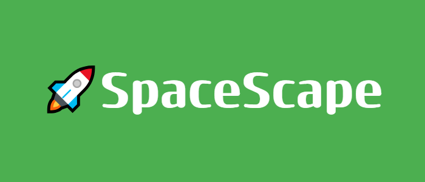
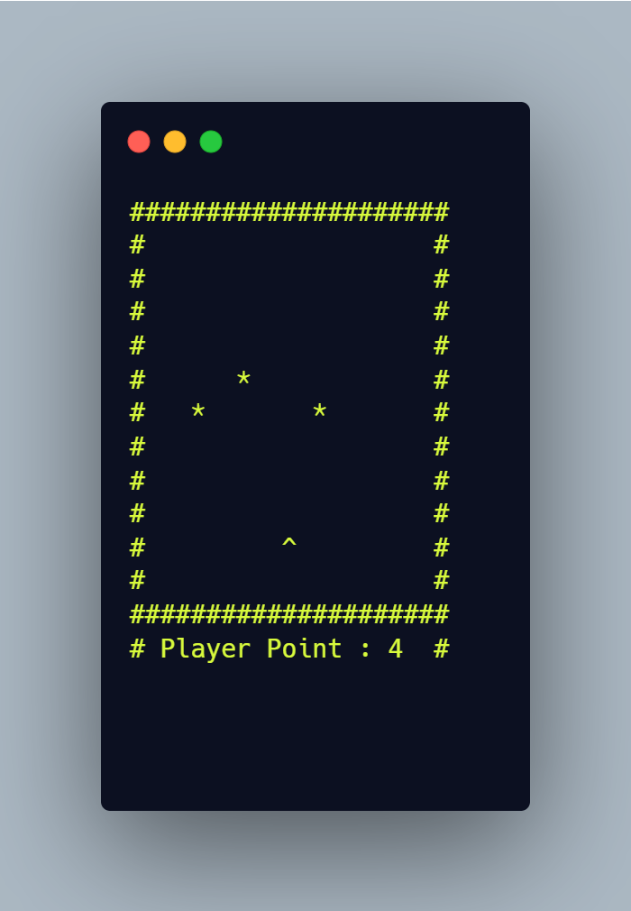

In this project , we are trying to survive incoming meteors. This is a terminal base c++ game.
# 🎮 Gameplay 
The goal is dodge the meteors and try to get point as much as we can. We control our ship with "W,A,S,D".
### Controls
* W → Up
* A → Left
* S → Down
* D → Right
* Q → Quit
#

# 🛠️ Compile and Run 
* Clone or download the repo
```sh
git clone https://github.com/furkansarsilmaz/SpacEscape.git

cd SpacEscape
```
* Compile the code 
```sh
g++ -o SpacEscape main.cpp
```
* Execute the code
```sh
./SpacEscape
```
# 📜 Notes
This project only tested on Windows. It's open source project and you can develop and share if you wish.